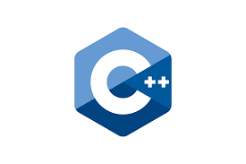
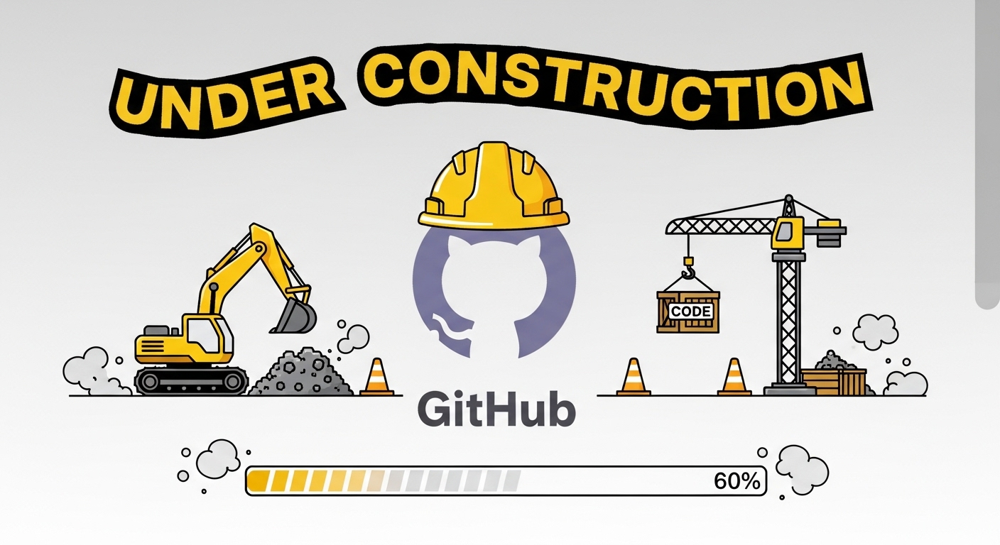

# 🚀 Formation C++ Moderne sur Ubuntu


**Un parcours progressif pour apprendre le C++ moderne, de la syntaxe de base au déploiement Cloud Native.**

<p align="center">
  
</p>

---

## 📖 Navigation

- [À propos](#-à-propos)
- [Pour qui ?](#-pour-qui-)
- [Contenu](#-contenu-de-la-formation)
- [Démarrage](#-démarrage-rapide)
- [Parcours suggéré](#-parcours-suggéré)
- [Licence](#-licence)
- [Auteur](#-auteur)

---

## 📋 À propos

Cette formation est née d'un constat simple : beaucoup de ressources C++ sont soit trop académiques, soit déconnectées des pratiques modernes de développement. J'ai essayé de créer quelque chose de différent — un guide qui vous accompagne du premier `Hello World` jusqu'au déploiement d'applications en conteneurs.

Ce n'est pas une référence exhaustive du langage (il y a cppreference pour ça !), mais plutôt un chemin balisé pour devenir opérationnel en C++ dans un environnement Linux/DevOps moderne.

**✨ Ce que vous trouverez :**

| | |
|---|---|
| 📚 **17 modules progressifs** | Du débutant absolu à l'expert |
| 🐧 **Focus Ubuntu/Linux** | Toolchain, debugging, profiling natif |
| 🔧 **C++ moderne** | C++11 → C++26, smart pointers, move semantics, concepts |
| 🐳 **Approche DevOps** | Docker, CI/CD, gRPC, observabilité |
| 📦 **Tooling complet** | CMake 3.31+, Conan 2.0, Ninja, ccache/sccache |
| 🇫🇷 **En français** | Et gratuit (CC BY 4.0) |

**⏱️ Durée estimée :** 120-170 heures selon votre rythme et niveau initial

---

## 🎯 Pour qui ?

Cette formation s'adresse à plusieurs profils :

| Profil | Point d'entrée suggéré |
|--------|------------------------|
| 🌱 **Débutant en programmation** | Partie I — Commencez par le début ! |
| 🔄 **Dev Python/Java/JS → C++** | Module 2 — Les fondamentaux ont des pièges |
| 🐧 **Sysadmin / DevOps** | Partie V — Docker, CI/CD, CLI tools |
| 🔙 **Retour au C++ après des années** | Module 4 — Le C++ moderne a beaucoup changé |
| 📈 **Dev C++ → niveau supérieur** | Partie VI — Optimisation, patterns, sécurité |

---

## 📚 Contenu de la formation

### Vue d'ensemble

```
PARTIE I   : Fondations (Modules 1-3)  
PARTIE II  : C++ Moderne (Modules 4-6)  
PARTIE III : Programmation Système Linux (Modules 7-8)  
PARTIE IV  : Tooling et Build Systems (Modules 9-11)  
PARTIE V   : DevOps et Cloud Native (Modules 12-13)  
PARTIE VI  : Sujets Avancés (Modules 14-16)  
PARTIE VII : Projet et Professionnalisation (Module 17)  
```

### Les 17 modules

| # | Module | Niveau | Thèmes clés |
|---|--------|--------|-------------|
| 1 | Environnement de développement | 🌱 Débutant | GCC 15, Clang 20, ccache, IDE, ELF |
| 2 | Fondamentaux du langage | 🌱 Débutant | Types, fonctions, mémoire |
| 3 | Programmation Orientée Objet | 🌱 Débutant | Classes, RAII, Rule of Five |
| 4 | C++ Moderne (C++11→26) | 🌿 Intermédiaire | Smart pointers, move semantics, lambdas, C++26 |
| 5 | Librairie Standard (STL) | 🌿 Intermédiaire | Conteneurs, algorithmes, ranges, templates |
| 6 | Gestion des erreurs | 🌿 Intermédiaire | Exceptions, std::expected, Contrats C++26 |
| 7 | Programmation Système | 🌳 Avancé | Threads, sockets, signaux, IPC |
| 8 | Parsing et formats | 🌳 Avancé | JSON, YAML, Protobuf, FlatBuffers |
| 9 | Build Systems | 🌳 Avancé | CMake 3.31+, Ninja, Conan 2.0 |
| 10 | Débogage et profiling | 🌳 Avancé | GDB, Valgrind, perf, sanitizers |
| 11 | Tests et qualité | 🌳 Avancé | Google Test, couverture, benchmark |
| 12 | Création d'outils CLI | 🌳 Avancé | CLI11, fmt |
| 13 | C++ et DevOps | 🌳 Avancé | Docker, CI/CD, observabilité |
| 14 | Optimisation | 🏔️ Expert | Cache CPU, SIMD, PGO, LTO |
| 15 | Interopérabilité | 🏔️ Expert | pybind11, Rust/cxx, WebAssembly |
| 16 | Patterns et sécurité | 🏔️ Expert | Design patterns, fuzzing, Safety Profiles |
| 17 | Architecture projet | 🏔️ Expert | Standards, pre-commit, collaboration |

📑 **Table des matières détaillée :** [SOMMAIRE.md](SOMMAIRE.md)

---

## 🚀 Démarrage rapide

### Prérequis

- Ubuntu 22.04+ (ou WSL2 sous Windows)
- ~10 Go d'espace disque
- Motivation et curiosité 🙂

### Installation de la toolchain minimale

```bash
# Mise à jour du système
sudo apt update && sudo apt upgrade -y

# Installation des outils essentiels
sudo apt install -y build-essential cmake ninja-build gdb git
```

### Installation de GCC 14/15 (C++23 / C++26)

Sur Ubuntu 24.04, GCC 13 est installé par défaut. Les exemples de cette formation utilisent des fonctionnalités C++23 et C++26 qui nécessitent GCC 14 ou 15 :

```bash
# Ajouter le PPA pour GCC 14/15
sudo add-apt-repository -y ppa:ubuntu-toolchain-r/test  
sudo apt update  

# Installer GCC 14 et 15
sudo apt install -y g++-14 g++-15

# Outils d'inspection binaire et de développement
sudo apt install -y binutils nasm valgrind strace ltrace
```

### Vérification

```bash
g++ --version      # GCC 13 (par défaut)  
g++-14 --version   # GCC 14 — support C++23 complet (std::ranges::to, etc.)  
g++-15 --version   # GCC 15 — support C++23/C++26 (std::print, contracts, etc.)  
cmake --version  
```

### Cloner cette formation

```bash
git clone https://github.com/NDXDeveloper/formation-cpp-moderne-ubuntu.git  
cd formation-cpp-moderne-ubuntu  
```

### Premier programme

```cpp
// hello.cpp
#include <print>  // C++23

int main() {
    std::println("Bienvenue dans le C++ moderne ! 🚀");
    return 0;
}
```

```bash
# Compilation (nécessite GCC 14+ pour std::print)
g++ -std=c++23 -o hello hello.cpp
./hello
```

> 💡 **Pas GCC 15 ?** Pas de panique, le Module 1 vous guide pas à pas pour configurer votre environnement et installer la bonne version.

---

## 🗓️ Parcours suggéré

### Option A : Parcours complet (~170h)

Suivez les modules dans l'ordre. Comptez 4-6 mois à raison de 1-2h par jour.

### Option B : Parcours accéléré pour devs expérimentés (~60h)

```
Semaine 1-2 : Modules 4-6 (C++ moderne, STL, erreurs)  
Semaine 3-4 : Modules 9-11 (CMake, debugging, tests)  
Semaine 5-6 : Modules 12-13 (CLI, DevOps)  
```

### Option C : Focus DevOps/SRE (~40h)

```
Module 1  → Toolchain  
Module 8  → JSON/YAML/Protobuf  
Module 9  → CMake  
Module 12 → Outils CLI  
Module 13 → Docker, CI/CD, Observabilité  
```

---

## 📁 Structure du projet

```
formation-cpp-moderne-ubuntu/
├── README.md                          # Ce fichier
├── SOMMAIRE.md                        # Table des matières détaillée
├── LICENSE                            # CC BY 4.0
│
├── partie-01-fondations.md
├── partie-02-cpp-moderne.md
├── ...
├── module-01-environnement-developpement-linux.md
├── module-02-fondamentaux-langage.md
├── ...
│
├── 01-introduction-cpp-linux/
│   ├── README.md
│   ├── 01-histoire-evolution-cpp.md
│   └── ...
├── 02-toolchain-ubuntu/
├── 03-types-variables-operateurs/
│   ├── README.md
│   ├── 01-typage-statique-inference.md
│   ├── 01.1-auto.md
│   └── ...
├── ...
├── 48-ressources/
├── conclusion/
│
└── assets/
    ├── images/
    └── examples/
```

---

## ❓ Questions fréquentes

**Q : Faut-il des connaissances préalables ?**
> Non pour les parties I et II. Une familiarité avec un langage de programmation aide, mais n'est pas obligatoire.

**Q : Pourquoi Ubuntu spécifiquement ?**
> La majorité des serveurs en production tournent sous Linux. Ubuntu est accessible et bien documenté. Les concepts s'appliquent à toutes les distributions.

**Q : Cette formation remplace-t-elle un cours universitaire ?**
> Non, et ce n'est pas l'objectif. Elle est complémentaire — plus orientée pratique et industrie, moins théorique.

**Q : Le contenu est-il à jour ?**
> La formation couvre C++26 comme standard ratifié, avec GCC 15 et Clang 20 comme compilateurs de référence. CMake 3.31+, Conan 2.x et les Safety Profiles sont traités dans leur état de mars 2026.

**Q : Puis-je utiliser ce contenu pour enseigner ?**
> Oui ! La licence CC BY 4.0 le permet, avec attribution.

---

## 📝 Licence

Ce projet est sous licence **Creative Commons Attribution 4.0 International (CC BY 4.0)**.

✅ Vous êtes libre de :
- **Partager** — copier et redistribuer le contenu
- **Adapter** — modifier, transformer et créer à partir du contenu
- Pour toute utilisation, y compris commerciale

📌 **À condition de** créditer l'auteur :

```
Formation C++ Moderne sur Ubuntu par Nicolas DEOUX  
https://github.com/NDXDeveloper/formation-cpp-moderne-ubuntu  
Licence CC BY 4.0  
```

---

## 👨‍💻 Auteur

**Nicolas DEOUX**

- 📧 [NDXDev@gmail.com](mailto:NDXDev@gmail.com)
- 💼 [LinkedIn](https://www.linkedin.com/in/nicolas-deoux-ab295980/)
- 🐙 [GitHub](https://github.com/NDXDeveloper)

Cette formation représente des centaines d'heures de travail. Si elle vous est utile, un petit message ou une étoile ⭐ sur le repo fait toujours plaisir !

---

## 🙏 Remerciements

Cette formation n'existerait pas sans les ressources exceptionnelles de la communauté C++ :

- 📖 [cppreference.com](https://en.cppreference.com/) — La référence incontournable
- 📚 [Effective C++](https://www.aristeia.com/books.html) de Scott Meyers
- 🎥 [CppCon](https://www.youtube.com/user/CppCon) — Des centaines de talks de qualité
- 🛠️ [Compiler Explorer](https://godbolt.org/) — L'outil indispensable

Merci aussi à tous les développeurs qui partagent leur savoir en open source. C'est ce qui rend cette industrie unique.

---

<div align="center">

**🎉 Bon apprentissage ! 🎉**

*Le C++ a la réputation d'être difficile. C'est en partie vrai — mais c'est aussi un langage incroyablement puissant et gratifiant à maîtriser. Prenez votre temps, pratiquez, et n'hésitez pas à relire les sections complexes plusieurs fois.*

*Bonne route !*

---

[](https://github.com/NDXDeveloper/formation-cpp-moderne-ubuntu)

**[⬆ Retour en haut](#-formation-c-moderne-sur-ubuntu)**

*Dernière mise à jour : Mars 2026*

</div> 

<div align="center">
<p align="center">
  
</p>
</div> 
